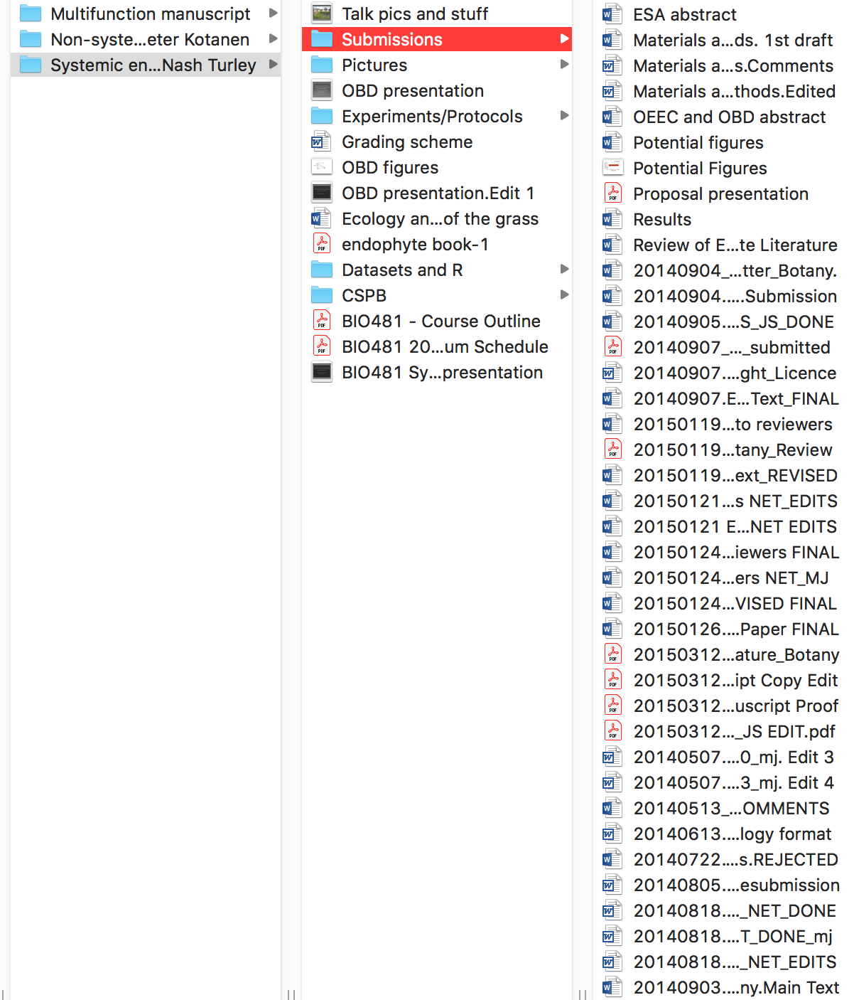
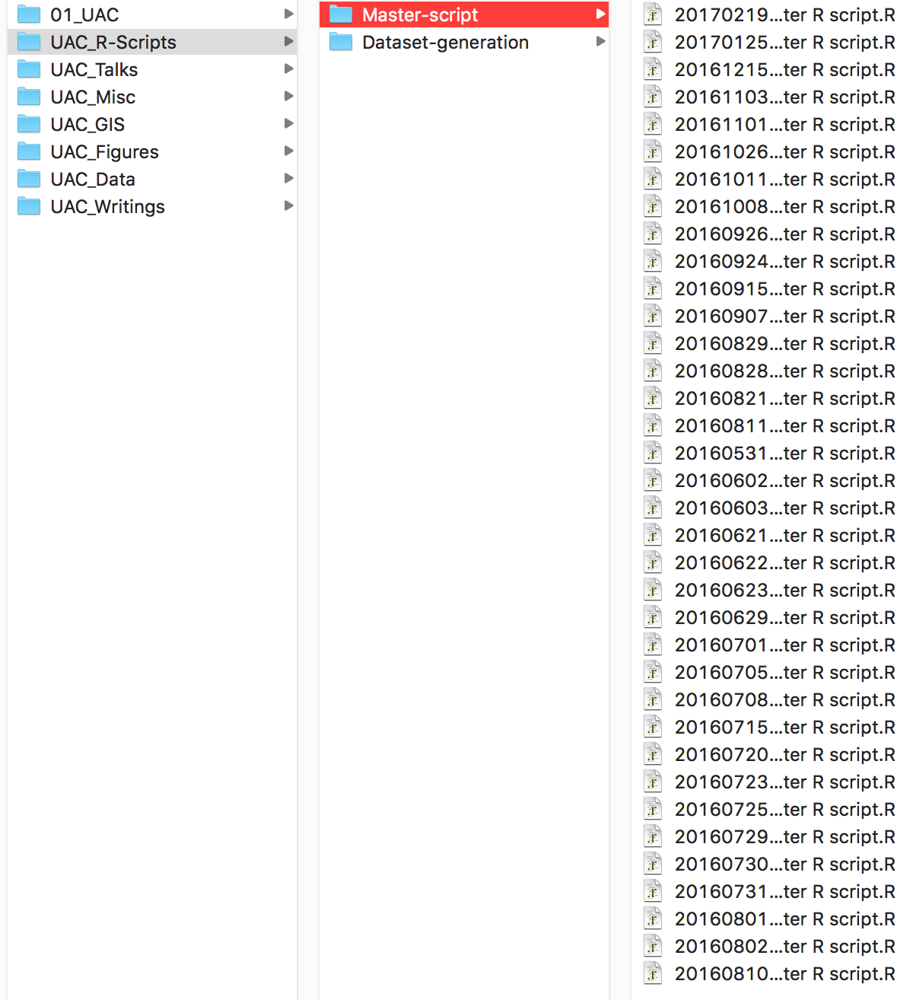

 - **Authors**: James Santangelo and Ahmed Hasan
 - **Research field**: Biology
 - **Lesson topic**: Introduction to project management for reproducible science in R
 - **Lesson content URL**: <https://github.com/utm-coders/studyGroup/tree/gh-pages/lessons/bash/project-management>

Do you struggle with figuring out the ideal directory structure for projects you're working on? Are you tired of having dozens of manuscript or script files cluttering up the directories on your computer? Have you ever overwritten some code that you later realized you still needed? Have you ever come back to a project after some time and forgotten where you were or how some of the files were generated? All of these problems (and more!) can be solved through effective project management.

In this tutorial, we will cover the basics of project management for reproducible science in R. Topics will include:
1. Directory structure
2. Documentation of directories (i.e, READMEs)
3. `R` projects and dependency management in `R`
5. Integrating `git` into your project management workflow

**Preparation for this lesson**: To follow along with this lesson, you will need to have `bash` installed. For Linux and OSX users, `bash` is included as part of the operating system. In OSX, it can be accessed with `terminal`.

For Windows users, there are many options (e.g. [Cygwin](https://www.cygwin.com/), [Windows Subsystem for Linux](https://msdn.microsoft.com/en-us/commandline/wsl/install_guide)). However, we recommend downloading `git bash`, which is packaged with [git](https://git-scm.com/) (a common version control system).

You will also need `R` installed. Detailed download instructions of all required software can be found [HERE](https://github.com/utm-coders/studyGroup/blob/gh-pages/lessons/install-git-python-r.md).

# Why think about project management?

Effective project management is essential for a few reasons. First, and perhaps most importantly, is that it does your future self a huge favour by ensuring you could always come back to a project at a later time and pick up where you left off without much hassle. Second, it ensures your projects (e.g., data analyses) will be reproducible by yourself and by others in the future, even if programs or packages are updated. Third, good project management facilitates collaboration by ensuring a consistent and well-documented workflow for all collaborators (in fact, this is what makes developing these workshops so seamless!). Finally, having well-organized projects just feels good and makes working on projects a breeze rather than a headache.

To put this in perspective, below is an example of a previous project of mine that I consider to be **bad** project management. There is no consistency in the naming of directories (some use spaces while others use forward slashes), there are many random files clutering up the project's root directory, and the manuscript submission folder is **filled** with different files, many of which I naively thought were the 'FINAL' versions.



Similarly, here is an example of a folder storing `R` scripts for analysing data. It looks nice and organized, with scripts organized by date, but there are a few issues. First, the script's title is not descriptive (what are the contents of *Master Script.R*?). Second, it's unclear how the script has changed from one version to the next. If you needed to access previous code, how would you know which version you needed? Finally, and this isn't obvious from the picture, the script would only work on **my** computer and may not work at all if many of the packages the script uses have been updated.



Througout the remainder of the tutorial, we'll go over some tools and tricks to help avoid making some of the mistakes that I used to make all the time. Importantly, this tutorial is only meant as a guide. For example, you may not like the directory structure that I use and that is completely fine. My goal is only to introduce you to some concepts in project management and reproducibility so that you can start to manage your own projects according to your needs.


# Directory structure

The way you decide to organize the directories for your project is entirely a matter of personal preference. I have modelled my directory structure off of the suggestions in [Bioinformatics Data Skills: Reproducible and Robust Reseach with Open Source Tools](https://www.amazon.ca/Bioinformatics-Data-Skills-Reproducible-Research/dp/1449367372) by [Vince Buffalo](http://www.vincebuffalo.com/). Regardless of how you choose to organize your directories, what I think is most helpful is that it's somewhat consistent across different projects, that the directories have descriptive names, and that they are documented with READMEs that describe important details about the files contained in the directory.

Lets open up a bash shell (i.e., `Terminal` on MacOS or `git-bash` on Windows) and navigate to the `project-management-demo` directory that accompanies this tutorial. *Recall, you can use `cd /path/to/directory` to navigate to a directory on your computer*. If you place the demo directory on your Desktop, this would be:

```
cd ~/Desktop/project-management-demo
```

Lets view the README file in the root directory.

```
less README.md
```

You'll notice the README file provides a few details about the purpose of the directory. If this was an actual project, you may want to put additional details (e.g., the questions being addressed by the project, an abstract, etc.)

Lets now list the files in the directory.

```
ls -alh
```

You'll see 4 subdirectories listed. They are:
1. `analysis`: Contains results from analyses (e.g., model outputs, tables, figures)
2. `data-clean`: Contains *clean* data that has been processed in some way using scripts in the `scripts` directory. This is the data that is meant to be analysed.
3. `data-raw`: Contains *raw* data. This data was likely inputed directly into excel or perhaps downloaded from another source (e.g., governmental database). It likely contains entry errors, missing data, unnecessary columns, etc., that need to be cleaned and processed prior to analyses. **Data files in this directory should not be used in analyses**
4. `scripts`: Contains scripts that will carry out the bulk of the work associated with this project.

Just by looking at the directories above, we can get a sense of what the workflow for this project might be:
1. Process raw data in `data-raw` using a script in `scripts`. Output this clean, processed data to `data-clean`
2. Analyse clean data in `data-clean` using a script in `scripts`. Output analyses to `analysis`

Importantly, all subdirectories also have README files that describe the directory's contents. Feel free to poke around and view some of them to get a sense of what writing a README file entails.


## Project management in R

Lets now work with some of the files in this directory to get a sense of the workflow described above.

### Starting the `Rproject`

First, open `Rstudio`.

We will now create an `Rproject`, which is a way of reproducibly working with data in R. `Rprojects` eliminate a lot of the headache of having to keep track of working directories and additionally integrate version control (using `git`) and dependency management (using `packrat`). This greatly facilitates reproducibility and collaboration, since the project's dependencies and directories will now be consistent across machines.

To start a new `Rproject`, navigate to `file > new project` and choose `existing directory`. Choose the `project-management-demo` directory that is part of this tutorial. Create the `Rproject`.

In the `files` pane in `Rstudio`, you should now see a `project-management-demo.Rproj` file. This `.Rproj` file contains the preferences for your `Rproject`. This is also the file that you and collaborators would click on to open the existing project, with all preferences maintained across platforms and computers.

One of the best things about `Rprojects` is that the working directory is automatically set to the directory containing the `.Rproj` file, regarless of which computer the file is opened on. We can confirm this now by typing the following the the **R console**.

```
getwd()
```

Notice the working directory is now the current project's location on your computer. This allows us to access files and run scripts without constantly having to switch directories.

### Initializing `Git`

Before moving on, lets initialize this project as a git repo. From your shell, make sure you are in the root of the project, then type:

```
git init
```

You have now started a git repository. Lets check the status of our repo.

```
git status
```

Git is telling us that it isn't tracking anything (as expected). In fact, there are a few files that we'll probably never want git to track. Let's add those to a file called `.gitignore` now.

```
vi .gitignore
```

Add `.Rhistory` and `.Rproj.user/` on separate lines in the file (Make sure you're in insert more by first typing `i`). Then, quit by typing `:wq`. Note you can add any other directories or files you don't want git to track directly to this file.

Check the status again by typing `git status`. You should no longer see the `.Rhistory` and `.Rproj.user/` file, but instead see the `.gitignore` file. Lets commit these changes.

```
git add .
git commit -m "Initial commit"
```

Another `git status` confirms that the repo is up to date and git hasn't recognized any changes.

### Initializing `Packrat`

Now that `git` is initialized and tracking the files in this directory, we can initialize `packrat`, which will keep track of installed packages and their versions. This ensures that if you come back to the project in two years, after having updated many packages, your analyses will still be based on the versions you were initially using.

While we can initialize `packrat` directly from the `Rproject` options, we're going to do it manually to give us more control over package installations. Lets install `packrat` by typing the following into your **RStudio console**

```
install.packages("packrat")
```

We now need to initialize the current project as a packrat project. We can do this by typing:

```
packrat::init(infer.dependencies = FALSE)
```

The `infer.dependencies = FALSE` argument tells packrat not to scan our code for calls to the `library()` function. In other words, we're starting a *bare* `packrat` project and will install all required packages ourselves. Go ahead and initialize the project.

Lets run a `git status` to see what has changed. Git has noticed changes to a few files.

You'll notice a new directory has been created entitled `packrat`. This is where all of the packages for this project will be installed along with packrat-specific settings and options.

Before moving on, lets add `packrat/src/` to our `.gitignore` to avoid commiting all the source code tarballs to our `git` repo. You can open you .gitignore file in `RStudio` and add `packrat/src/` onto a new line, or type the following into your terminal.

```
echo packrat/src/ >> .gitignore
```

Lets now commit all of these changes.

```
git add .
git commit -m "Adding packrat to project"
```

Similar to `git`, packrat allows you to check the status the projects dependencies. Lets got ahead a do that by typing the following in the **R console**.

```
packrat::status()
```

It tells us we're up to date. This is because we haven't installed any packages yet. Indeed, if you look uder the `packages` tab in `Rstudio` you'll notice the packrat library only includes `packrat` and nothing else. In fact, `packrat` doesn't even 'see' the packages that are installed system-wide. We can confirm this by trying to load `tidyverse`.

```
library(tidyverse)
```

`Packrat` returns an error saying there is no such package. This may seem inconvenient since we know we have the package installed, but in reality this is the beauty of `packrat`: it allows us to keep multiple versions of packages, each tied to their own environments, to ensure consistency in code behaviour over time. Let's now install the packages we'll use today.

```
install.packages("tidyverse")
```

The above command will take a couple minutes to run. Once it finishes, lets check the status of our `packrat` library

```
packrat::status()
```

`Packrat` now recognized the packages we installed but tells us they are not currently being recorded (similar to how `git` requires you to explicitely add files before commiting). Lets follow the suggestion to run `packrat::snapshot()`

`Packrat` has now written those packages and versions to our `packrat.lock` file. When this `Rproject` is opened, `Rstudio` will recognize that `Packrat` is enable and load packages from the correct library. It will additionally install any packages with the correct versions into that library it they are not already installed (e.g., if it's a new computer).

Of course, by modifying the `packrat.lock` file, `git` has surely noticed this change. Type `git status` in your **Shell** to confirm. Let's now add the `packrat.lock` file and commit.

```
git add packrat/packrat.lock
git commit -m "Adding tidyverse to packrat library"
```

Now we're up to date with both `Packrat` and `git`!

You can install or remove packages as needed. Just make sure to occasionally run `packrat::status()` and follow the recommendations to keep up to date. `Packrat` is very versatile. You can read more about it [HERE](https://rstudio.github.io/packrat/).

### Back to R

Now that everything in our project is being version controlled and properly managed, lets start actually working with some data.

You'll notice the `AllCities_AllPlants.csv` file in `data-raw`. This file contains phenotypic data on \~11,000 clover plants collected from 16 cities, with \~40 populations per city and \~15 plants per population. What we really want for our analyses, however, is the phenotype mean for each populations and for each city (i.e., averaging the plants within each population). Thankfully, we've written a script for that!

The phenotype of interest here is whether plants produce hydrogen cyanide (HCN). Therefore, the population means will be the frequency of HCN in each population, and we're interested in understanding how this frequency varies across the urbanization gradients present across our 16 cities.

Lets open the `create_AllCities_AllPopulation.R` file in `scripts/R/data-processing`. The details of the script are not important, although there are two key features:
1. Data is read from the `data-raw` directory and written to `data-clean`
2. The path to the data is specified relative to the project's root.

Lets execute the script in `Rstudio`. You can highlight all text using `Ctrl/Cmd A` and then execute using `Ctrl/Cmd Enter`.

Under the `files`, notice we have a new file in `data-clean`. This is the data we'll use for analyses.

`Git` also sees this new file. Lets go ahead and commit it.

```
git add .
git commit -m "Adding clean dataset for analysis"
```

Lets now open the `clineAnalyses.R` file in `scripts/R/`. This script will output regression plots of the frequency of HCN within a populations against distance to the urban core for each of the 16 cities into `analysis/figures/`. It will additionally output the results of the linear models of HCN against distance for each city as a table into `analysis/tables/`.

Of course, `Git` recorgnized all of these new files. Lets go ahead and commit them.

```
git add .
git commit -m "Adding figures and tables"
```

The beauty about this kind of workflow is that everything after the initial data collection is automated. This means that if any of the files change, the scripts just need to be re-run to regenerate all of the results. In addition, everything is well documented so that anyone (including future you) can understand it. Finally, collaborators can easily open your project (from GitHub, for example), and run the analyses with minimal hassle.

## A few closing notes

1. We're focused mostly on `R`, but dependency management is also important in other programming languages such as Python. For example, Anaconda allows you to create self-contained environments called `conda environments` where project-specific libraries can be stored and managed. You can read more about these [HERE](https://conda.io/projects/conda/en/latest/user-guide/tasks/manage-environments.html?highlight=environment).
2. `Packrat` is not the only dependency management system for R. Alternative include: [Checkpoint](https://cran.r-project.org/web/packages/checkpoint/vignettes/checkpoint.html) or creating your own local R package (see [HERE](https://kbroman.org/pkg_primer/pages/build.html)). Finally, [Docker](https://www.docker.com/) allows you to create self-contained environments for any language (or multiple at once) or application, although note the learning curve is steeper.
3. Be sure to `git status` and `packrat::status()` often to track changes in the repo and modifications to files you want versioned.


